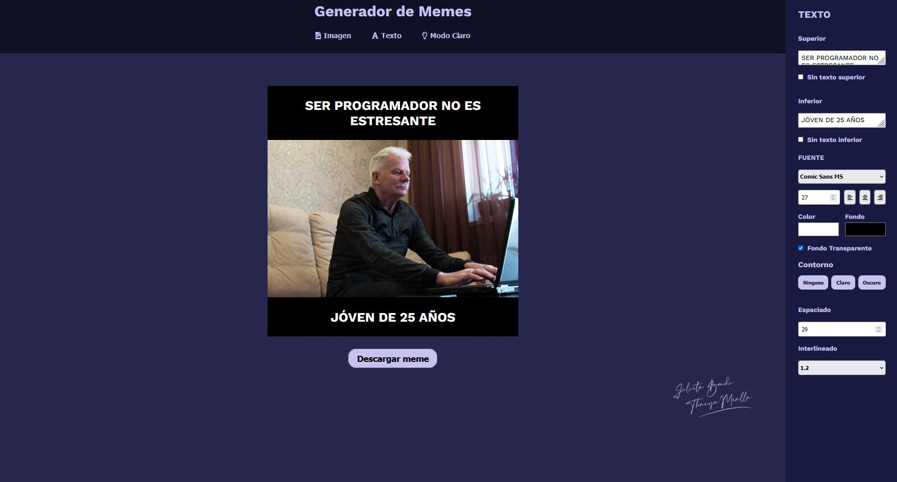

# Generador de Memes Julieta Bondi - Thanya Mealla

## Tareas realizadas:
* Texto superior y texto inferior
* Sin texto superior y sin texto inferior 
* Cambiar tipo de fuentes, Tamaño y posicionamiento (left-center-right)
* Cambiar color de las fuentes/letras y el fondo de las mismas
* Fondo Transparente 
* contornos de fuente; ninguno-claro-oscuro
* Espaciado e interlineado de texto
* url que cargue imagen al index 
* El color del fondo del contenedor del meme puede ser cambiado.
* Los modos en los que se mezcla (range) el color con la imagen.
* El botón restablecer filtros también funcional.
* Utilizamos [dom-to-image](https://github.com/tsayen/dom-to-image) y [FileSaver](https://github.com/eligrey/FileSaver.js/) para convertir el DOM en imagen y descargarla.

# Cosas extras que añadimos:
* Un input para poder añadir imágenes de forma local.
* Ajustamos algunos tamaños de varios elementos por cuestion de accesibiidad.
* Añadimos de forma responsive todo lo necesario, adaptando el contenido para todas las vistas y creando la funcionalidad del aside para abrir o cerrarse dependiendo si es Mobile o Tablet al igual que estar fijo en modo Desktop.
* Añadimos hovers para ser más amigable a la vista las cosas seleccionables.
* Reciclamos una función de filtros que vimos en clases. Dicha función sí aplicaba filtros, pero solo un filtro a la vez, si querías incluir otro filtro sobrescribía el anterior, por lo tanto, solo se podía tener uno. Tuvimos que recrearla de cero para que funcione como debe y optimizarla.